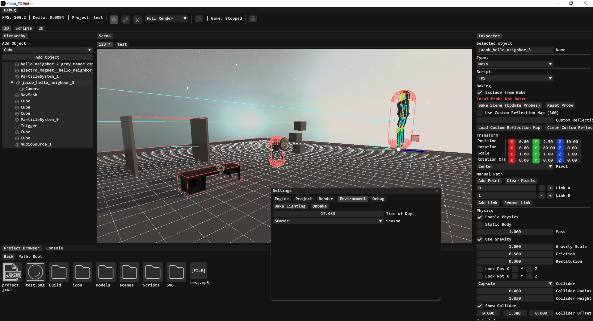

## My own 3D Game Engine

Written in C++ using OpenGL.

Designed for ease of use, a clean interface, and extensive scripting capabilities.

**[Read the Scripting Documentation](Scripting.md)**

## Codebase is currently under heavy refactoring!

Use Issues for bugs and suggestions.

## Included Third-Party Libraries

| Dependency | License |
| :--- | :--- |
| [GLEW](https://github.com/nigels-com/glew) | [Modified BSD](https://github.com/nigels-com/glew/blob/master/LICENSE.txt) |
| [GLFW](https://github.com/glfw/glfw) | [Zlib](https://github.com/glfw/glfw/blob/master/LICENSE.md) |
| [cgltf](https://github.com/jkuhlmann/cgltf) | [MIT](https://github.com/jkuhlmann/cgltf/blob/master/LICENSE) |
| [nanosvg](https://github.com/memononen/nanosvg) | [Zlib](https://github.com/memononen/nanosvg/blob/master/LICENSE.txt) |
| [stb_easy_font](https://github.com/nothings/stb) | [Public Domain](https://github.com/nothings/stb/blob/master/LICENSE) |
| [stb_image](https://github.com/nothings/stb) | [Public Domain](https://github.com/nothings/stb/blob/master/LICENSE) |
| [GLM](https://github.com/g-truc/glm) | [Happy Bunny / MIT](https://github.com/g-truc/glm/blob/master/copying.txt) |
| [Jolt Physics](https://github.com/jrouwe/JoltPhysics) | [MIT](https://github.com/jrouwe/JoltPhysics/blob/master/LICENSE) |
| [Lua](https://www.lua.org/) | [MIT](https://www.lua.org/license.html) |
| [Dear ImGui](https://github.com/ocornut/imgui) | [MIT](https://github.com/ocornut/imgui/blob/master/LICENSE.txt) |
| [ImGuizmo](https://github.com/CedricGuillemet/ImGuizmo) | [MIT](https://github.com/CedricGuillemet/ImGuizmo/blob/master/LICENSE) |
| [SoLoud](https://github.com/jarikomppa/soloud) | [Zlib](https://github.com/jarikomppa/soloud/blob/master/LICENSE) |

*Note: These libraries may have their own dependencies with different licenses.*

