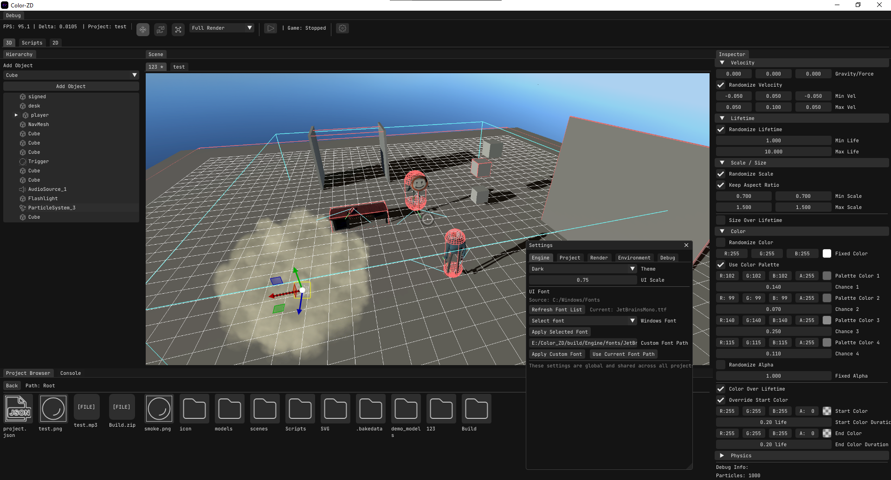
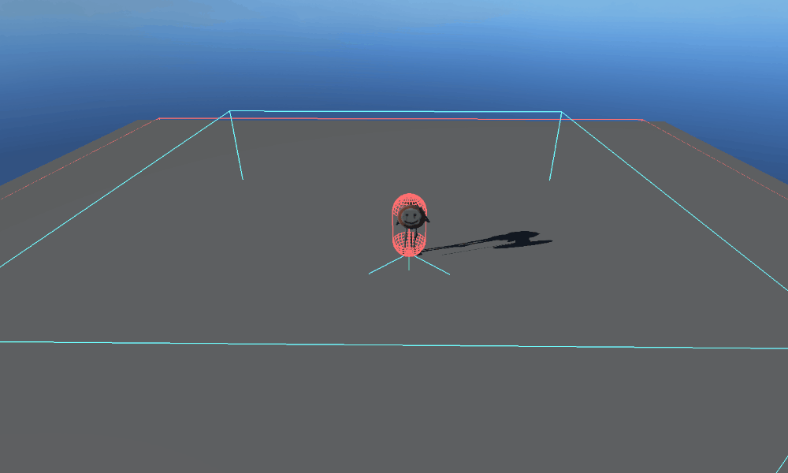
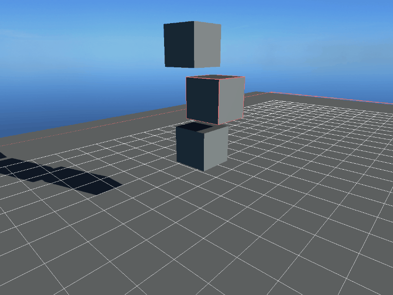

# 🎮 My Own 3D Game Engine

**A custom 3D game engine written in C++ and OpenGL, built for ease of use, a clean interface, and extensive scripting capabilities.**

[Scripting Documentation](Scripting.md) · [Report an Issue](../../issues)

---

## ⚠️ Project Status

> The codebase is currently under **heavy refactoring**. Expect breaking changes and incomplete features.
>
> Please use the **Issues** tab for bug reports and suggestions.

## ✨ Highlights

A quick look at some of the engine's core systems in action.

<table>
  <tr>
    <td align="center" width="33%">
       
      <b>Simple AI</b> A basic AI agent navigating and moving across a flat plane.
    </td>
    <td align="center" width="33%">
       
      <b>Smoke Simulation</b> Realistic smoke rendering and effects.
    </td>
    <td align="center" width="33%">
       
      <b>Jolt Physics</b> Three cubes falling and colliding, demonstrating physics via Jolt.
    </td>
  </tr>
</table>

## 📦 Included Third-Party Libraries

| Dependency | Purpose | License |
| :--- | :--- | :--- |
| [GLEW](https://github.com/nigels-com/glew) | OpenGL extension loading | [Modified BSD](https://github.com/nigels-com/glew/blob/master/LICENSE.txt) |
| [GLFW](https://github.com/glfw/glfw) | Window & input handling | [Zlib](https://github.com/glfw/glfw/blob/master/LICENSE.md) |
| [cgltf](https://github.com/jkuhlmann/cgltf) | glTF model loading | [MIT](https://github.com/jkuhlmann/cgltf/blob/master/LICENSE) |
| [nanosvg](https://github.com/memononen/nanosvg) | SVG parsing & rasterization | [Zlib](https://github.com/memononen/nanosvg/blob/master/LICENSE.txt) |
| [stb_easy_font](https://github.com/nothings/stb) | Lightweight text rendering | [Public Domain](https://github.com/nothings/stb/blob/master/LICENSE) |
| [stb_image](https://github.com/nothings/stb) | Image loading | [Public Domain](https://github.com/nothings/stb/blob/master/LICENSE) |
| [GLM](https://github.com/g-truc/glm) | Mathematics library | [Happy Bunny / MIT](https://github.com/g-truc/glm/blob/master/copying.txt) |
| [Jolt Physics](https://github.com/jrouwe/JoltPhysics) | Physics simulation | [MIT](https://github.com/jrouwe/JoltPhysics/blob/master/LICENSE) |
| [Lua](https://www.lua.org/) | Scripting language | [MIT](https://www.lua.org/license.html) |
| [Dear ImGui](https://github.com/ocornut/imgui) | Editor UI | [MIT](https://github.com/ocornut/imgui/blob/master/LICENSE.txt) |
| [ImGuizmo](https://github.com/CedricGuillemet/ImGuizmo) | Editor gizmos | [MIT](https://github.com/CedricGuillemet/ImGuizmo/blob/master/LICENSE) |
| [SoLoud](https://github.com/jarikomppa/soloud) | Audio engine | [Zlib](https://github.com/jarikomppa/soloud/blob/master/LICENSE) |

> **Note:** These libraries may have their own dependencies with different licenses.

